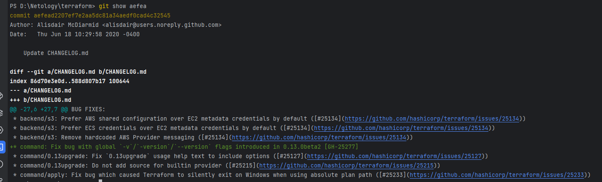
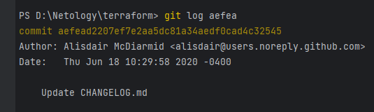
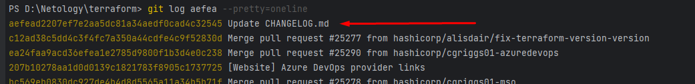
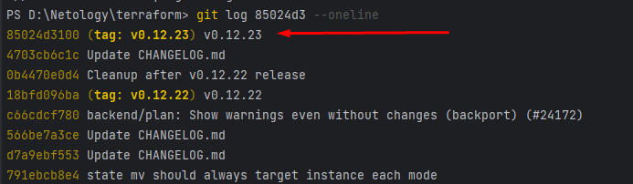
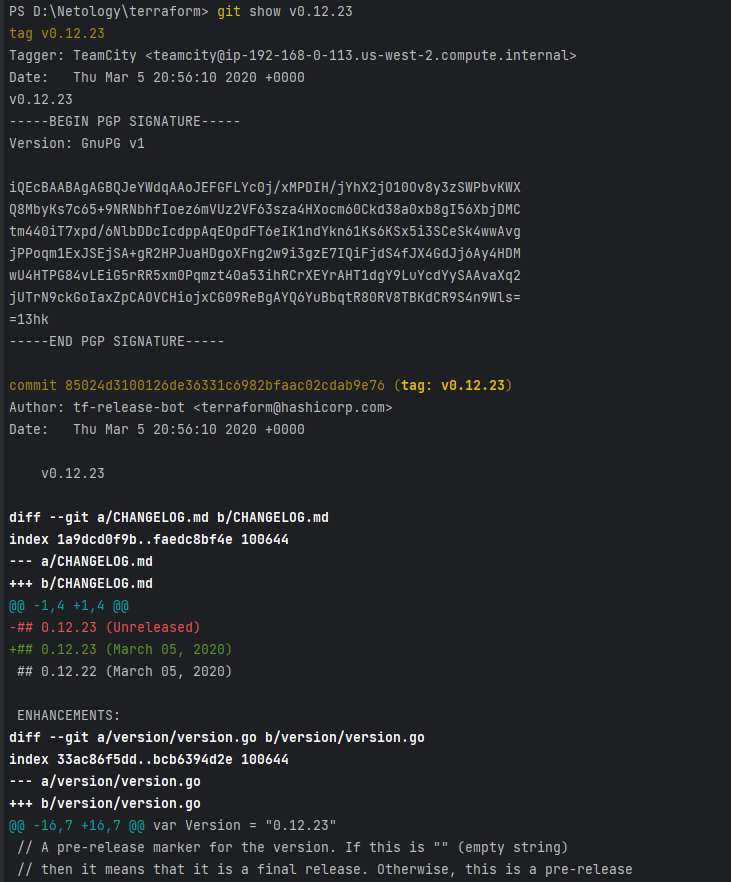
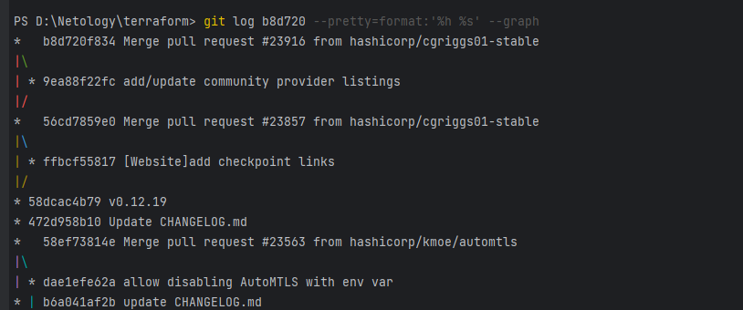
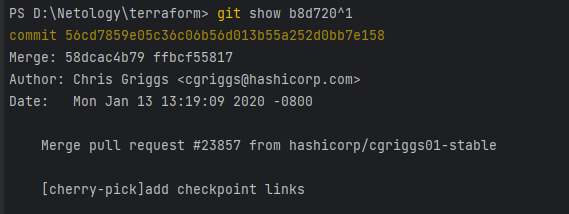
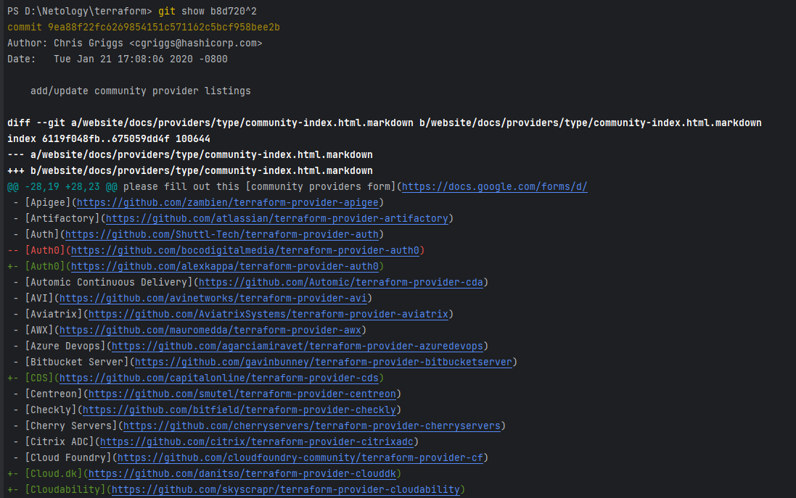
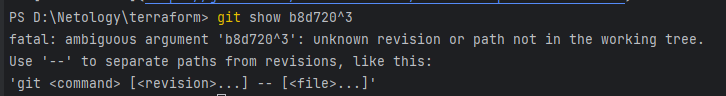
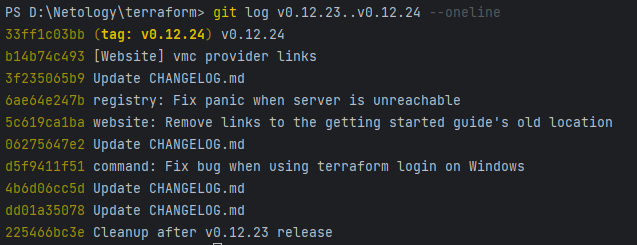

# Автор: Федорчук Дмитрий Сергеевич DEVOPS-33

# Домашнее задание к занятию «Инструменты Git»

### Инструкция к заданию

1. Склонируйте [репозиторий](https://github.com/hashicorp/terraform) с исходным кодом Terraform.
2. Создайте файл для ответов на задания в своём репозитории, после выполнения прикрепите ссылку на .md-файл с ответами в личном кабинете.
3. Любые вопросы по решению задач задавайте в чате учебной группы.

------

## Задание

В клонированном репозитории:

1. Найдите полный хеш и комментарий коммита, хеш которого начинается на `aefea`.
2. Ответьте на вопросы.

* Какому тегу соответствует коммит `85024d3`?
* Сколько родителей у коммита `b8d720`? Напишите их хеши.
* Перечислите хеши и комментарии всех коммитов, которые были сделаны между тегами  v0.12.23 и v0.12.24.
* Найдите коммит, в котором была создана функция `func providerSource`, её определение в коде выглядит так: `func providerSource(...)` (вместо троеточия перечислены аргументы).
* Найдите все коммиты, в которых была изменена функция `globalPluginDirs`.
* Кто автор функции `synchronizedWriters`? 

*В качестве решения ответьте на вопросы и опишите, как были получены эти ответы.*

---

### Правила приёма домашнего задания

В личном кабинете отправлена ссылка на .md-файл в вашем репозитории.

### Критерии оценки

Зачёт:

* выполнены все задания;
* ответы даны в развёрнутой форме;
* приложены соответствующие скриншоты и файлы проекта;
* в выполненных заданиях нет противоречий и нарушения логики.

На доработку:

* задание выполнено частично или не выполнено вообще;
* в логике выполнения заданий есть противоречия и существенные недостатки.

## Решение

Склонировал репозиторий с исходным кодом Terraform. Создал репозиторий для отчета по заданию.

1. С помощью команд git show aefea и git log aefea ищу полный хэш и комментарий коммита, хэш которого начинается на aefea:

Вижу, что полный хэш коммита в обоих случаях aefead2207ef7e2aa5dc81a34aedf0cad4c32545 и комментарий к коммиту "Update CHANGELOG.md".

Команда git show в первую очередь нужна для отображения какого-го либо одного коммита. Она отображает подробные данные коммита, включая весь diff. Также команда может отображать не закоммиченные объекты.

Команда git log нужна для отображения диапазона коммитов. По умолчанию выводит только хэш коммита, автора и комментарий к коммиту, тэг коммита. 

При необходимости вывод можно сократить командой git log aefea --pretty=oneline:

2. Ответы на вопросы:

* Какому тегу соответствует коммит 85024d3?

Смотрю вывод команды git log 85024d3 --oneline и вижу, что коммиту 85024d3 соответствует тэг tag: v0.12.23

Можно сделать наоборот, проверить какой коммит соответствует тэгу v0.12.23. Можно проверить командами git show v0.12.23 или git log v0.12.23.

git show v0.12.23 покажет более полную информацию, где видно того, кто создал тэг, дату создания, эхш коммита и сам коммит, цифровую подпись коммита и диффы:

* Сколько родителей у коммита b8d720? Напишите их хеши.

Проверяю вывод команды git log b8d720 --pretty=format:'%h %s' --graph и вижу, что коммит b8d720 это мерж коммит и у него 2 родителя:

Проверяю первого родителя командой git show b8d720^1 и вижу результат:

Проверяю второго родителя командой git show b8d720^2 и вижу результат:

Пытаюсь проверить третьего родителя командой git show b8d720^3 и вижу, что третьего родителя не существует:

Хэши родителей коммита b8d720:
Первый родитель - 56cd7859e05c36c06b56d013b55a252d0bb7e158

Второй родитель - 9ea88f22fc6269854151c571162c5bcf958bee2b

* Перечислите хеши и комментарии всех коммитов, которые были сделаны между тэгами v0.12.23 и v0.12.24.

Командой git log v0.12.23..v0.12.24 --oneline выводим коммиты которых нет в тэге v0.12.23, но есть в тэге v0.12.24:

Видно, что между тэгами v0.12.23 и v0.12.24 есть 9 коммитов.